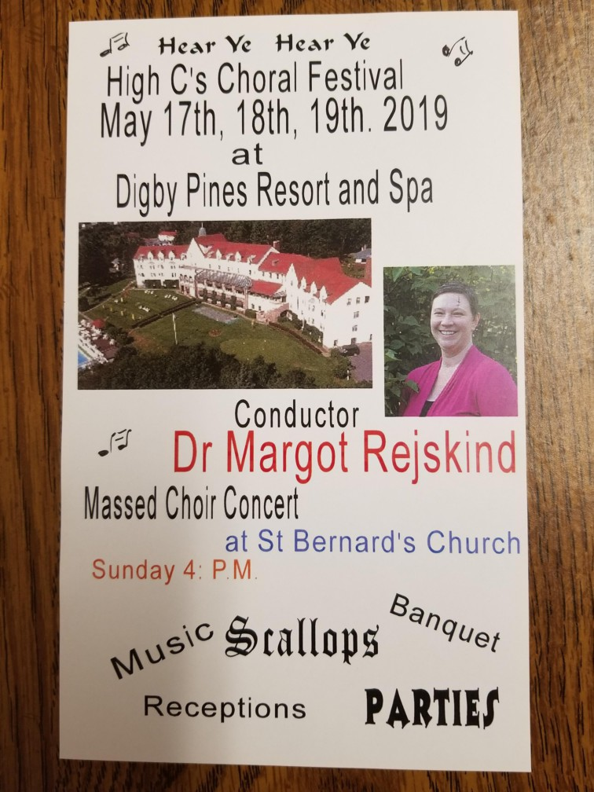

This year, we are excited that our own Director Dr. Margot Rejskind will be the guest conductor for the Digby High C's Choral Fest.

This is a fast and fun choral bootcamp weekend, open to all choral singers around the Maritimes and beyond. Singers receive music in advance, then show up for rehearsals Friday and Saturday for a performance Sunday afternoon.

All are welcome to register and participate, even if you're not currently affiliated with a choir. For more information, visit the [High Cs web site](https://www.highcs.org/).
