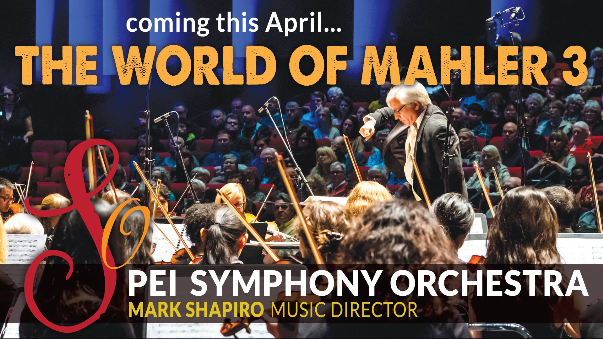

The women of Summerside Community Choir are excited to be a part of this choral-orchestral extravaganza with the PEI Symphony Orchestra and several other island choral ensembles!

> _"This infrequently performed masterpiece is considered one of the 10 greatest symphonies of all time by BBC Music Magazine and will feature an extended orchestra, a combined treble chorus of 70 adults and youth – comprising members of Sirens, Summerside Community Choir, The UPEI Women’s Ensemble, Luminos Ensemble, Le Ragazze Girls Vocal Ensemble and Harmonia Girl’s Choir – and mezzo-soprano soloist Christianne Rushton."_

Please visit the [PEI Symphony website](https://peisymphony.com/2019/02/21/the-world-of-mahler-3/) or [Facebook Event Page](https://www.facebook.com/events/2369100906441838/?active_tab=about) for more information. [**Tickets can be purchased online and in person at the Confederation Centre Box Office**](https://boxoffice.confederationcentre.com/online/)
