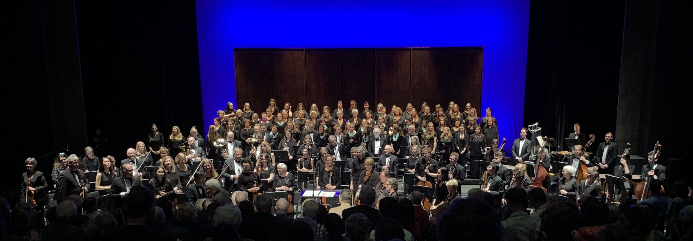
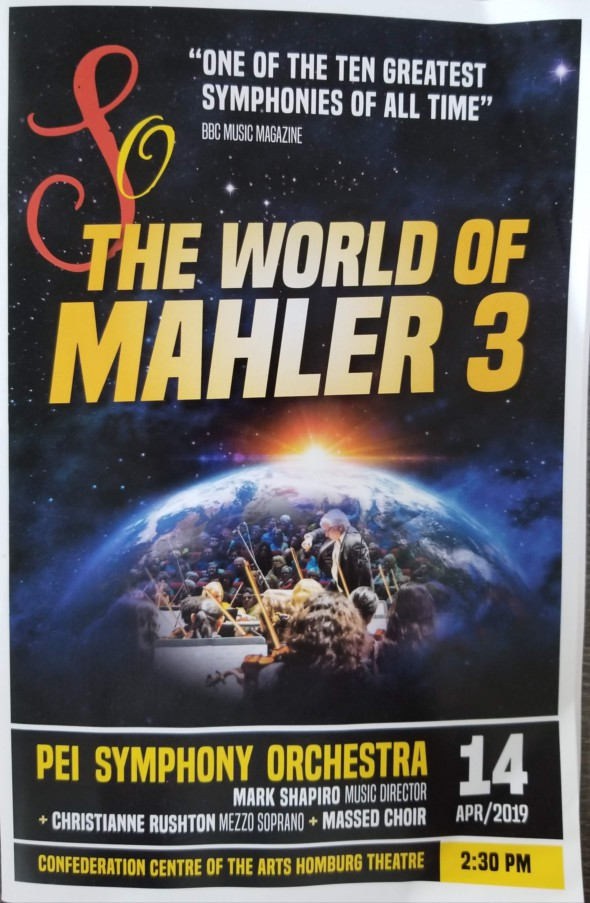
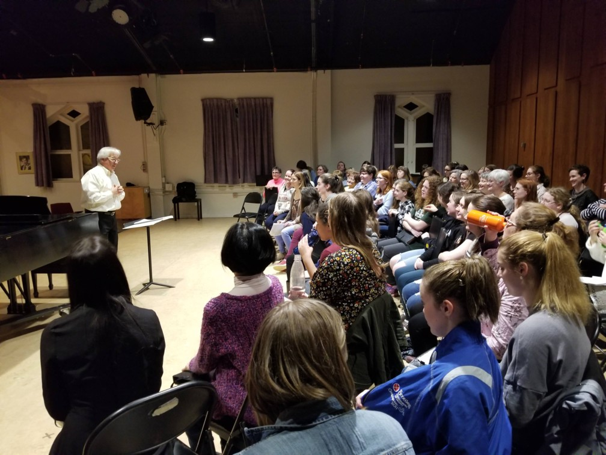
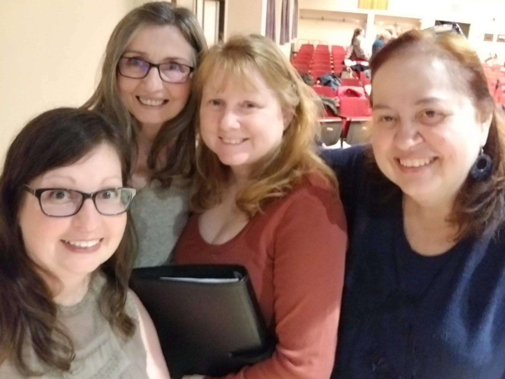
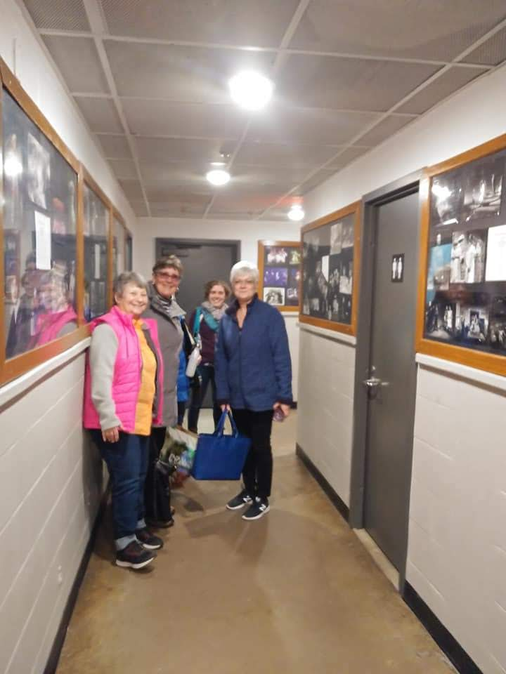
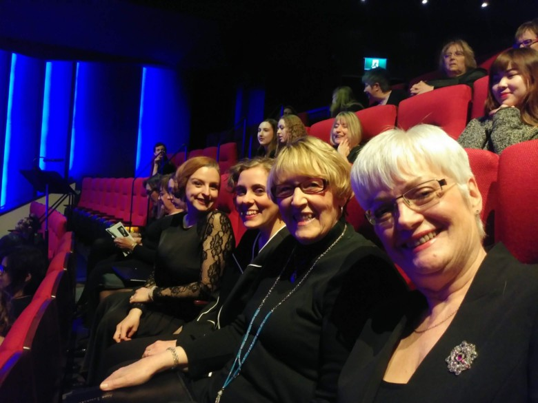
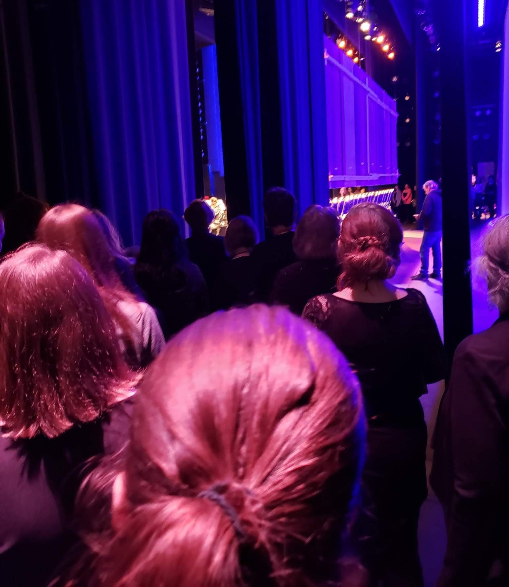
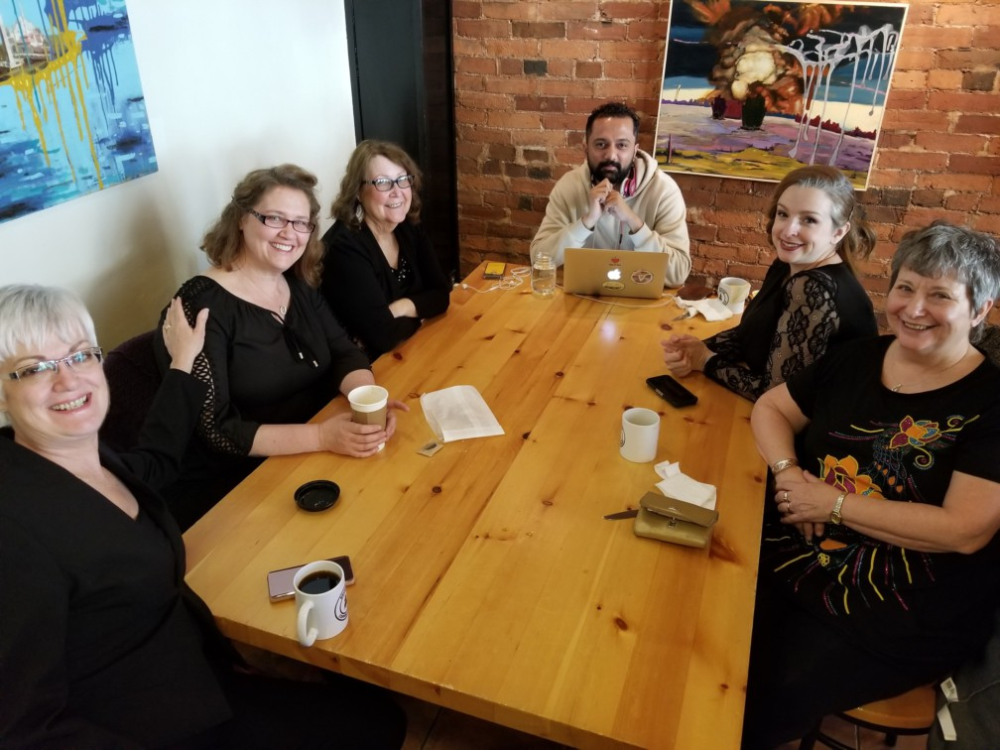

---

title: PEI does Mahler
sub_heading: 150 musicians perform the Canadian premiere of Yoon Jae Lee's orchestral
  reduction of Mahler's 3rd
date: 2019-04-14

---

75 instrumentalists and 75 choristers combined forces on the weekend for a spectacular performance!

Under the direction of Mark Shapiro, the women of Luminos Ensemble, Sirens, Summerside Community Choir and the UPEI Vocal Ensemble along with the younger women of Harmonia and Le Ragazze accompanied the PEI Symphony Orchestra and mezzo soprano Christianne Rushton in an ambitious production of Mahler 3.

After only a few weeks of separate rehearsals, our singers enjoyed coming together with the other musicians for an intensive practice weekend and performance at the ConfederationCentre  of the Arts in Charlottetown.

Thank you to Maestro Mark Shapiro, choral directors Dr. Margot Rejskind, Kelsea McLean, Sung Ha Shin-Bouey, our fellow musical collaborators, and our wonderful audience for an amazing weekend!

[Facebook Event Page](https://www.facebook.com/events/2369100906441838/)

 
