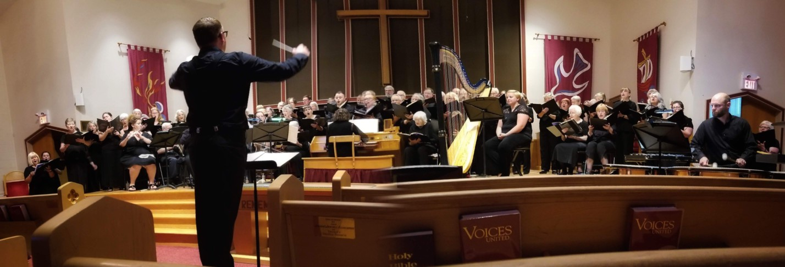
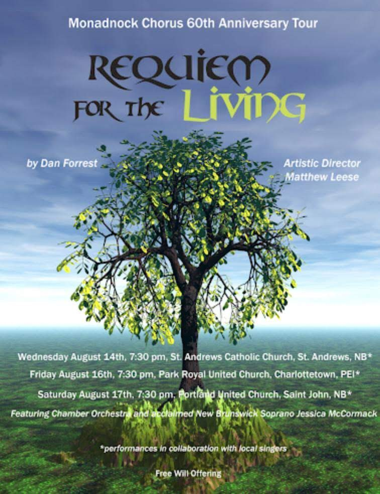
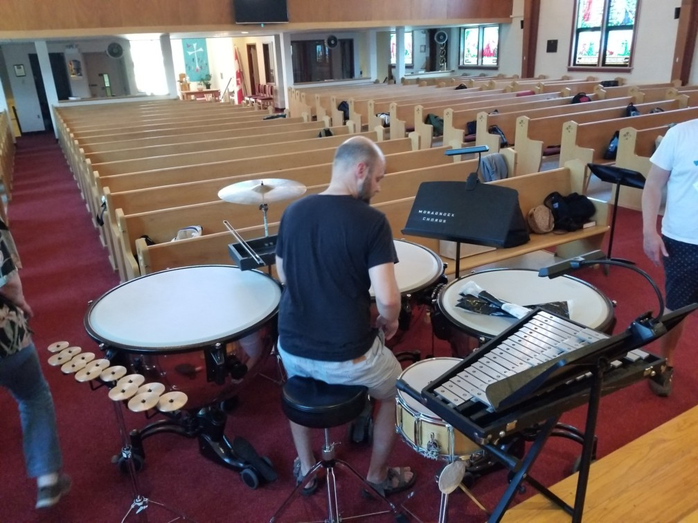
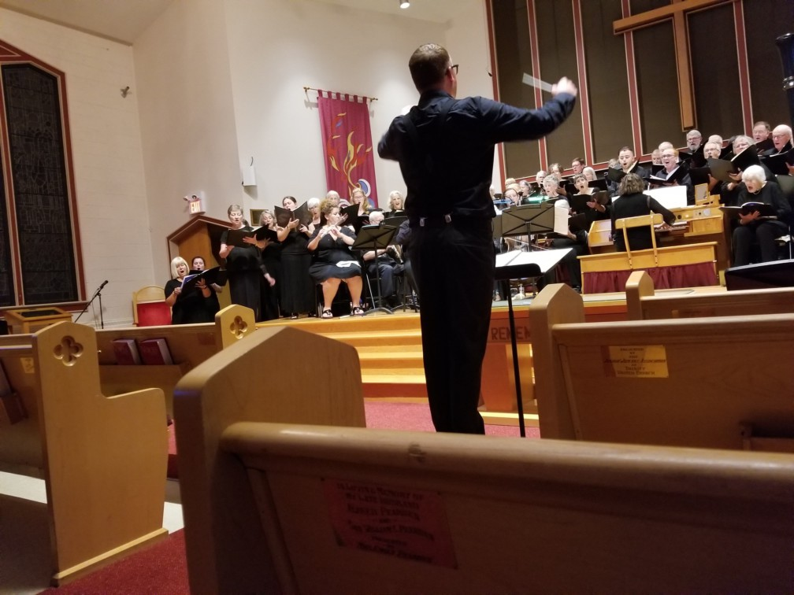
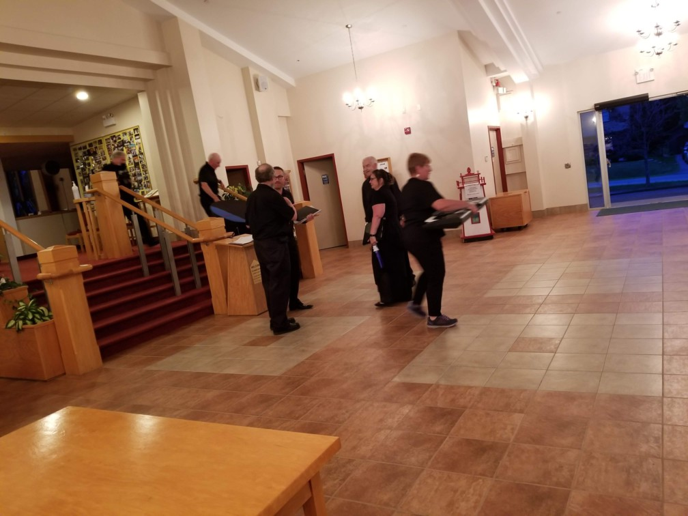
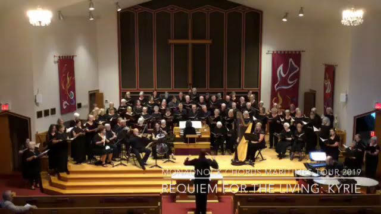

---

title: Guest appearance with Monadnock Community Chorus - Requiem for the Living
sub_heading: A handful of our singers joined in this collaborative tour around the
  Maritimes
date: 2019-08-18

---

The Monadnock Community Chorus from Peterborough, New Hampshire, celebrated their 60th anniversary with a collaborative concert tour of the Maritimes, involving local musicians at every stop, and hitting Charlottetown PEI on Friday August 16.

Several of our members were fortunate enough to participate in this unique experience. We purchased our own sheet music ahead of time, listened to many practice videos on YouTube, but didn't actually perform together with the travelling ensemble until a 90 minute rehearsal just hours before the concert!

We are thrilled that Artistic Director Matthew Leese contacted the Summerside Community Choir to be the Monadnock Chorus' "partner in crime" for their PEI stop, and admire his bravery in letting local musicians pretty much walk up on stage and join them. We think we held our own, and hope this is the beginning of a wonderful collaborative relationship between our two choirs.

[Listen to a short snippet of the performance on the Monadnock Chorus' Facebook Page!](https://www.facebook.com/monadnockchorus/videos/2786196348075106/)
