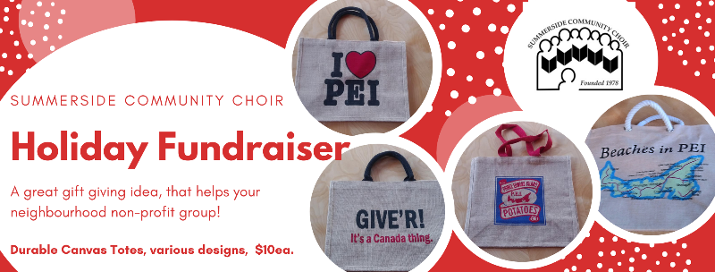

---

title: A bag to send 2020 packing??
date: 2020-11-18 

---

We have many things to be thankful for on PEI, one of which is that some members of our choir can continue to meet, with masks and distancing, for some much-needed social singing. 

We sadly won't be able to put on a Christmas show for you this year and have waived our membership fee for our singers, but even if the show doesn't go on... some of the recurring costs do!

You can show your support for the Summerside Community Choir with our PEI-themed holiday fundraiser. Send burlap bags to friends and family who weren't able to visit the island this year, or use them as shopping bags while you support local PEI businesses in your area.

We have four designs available and bags are $10 each and all proceeds will help us keep going while our live performances are on hold.

You can arrange a purchase through your friendly, neighbourhood choir member or email us at sumchoir@gmail.com for payment and pick up details. If you're in the Summerside area, we can probably arrange delivery!  

<!--  -->